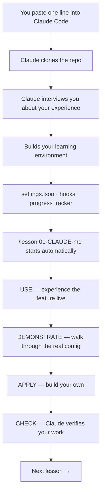

# claude-code-learn

<div align="center">


<br>


<br>

### A Claude Code course where Claude is the teacher.<br>You learn each feature by using it. The repo itself is the lesson.

<br>

*You need Claude Code. That's it. Open Claude Code and paste one line. Claude handles everything.*

<br>

[Get Started](#-get-started) · [How It Works](#-how-it-works) · [The Lessons](#-the-lessons) · [Commands](#-commands)

---

> **The CLAUDE.md IS lesson 01.** The skills driving `/lesson` ARE lesson 03. The hooks explaining every action ARE lesson 04. You learn each feature by using it, seeing its config, and building your own.

</div>

<br>

## 

Seven interactive lessons that teach every major Claude Code feature — CLAUDE.md, settings, skills, hooks, agents, and MCP.

Most tutorials talk *about* a tool. This one teaches Claude Code **by being a working example of Claude Code.**

You don't read about skills — you use `/lesson`, which is a skill.
You don't read about hooks — you watch hooks fire as you work.
You don't read about CLAUDE.md — you open this repo's CLAUDE.md and see it shaping Claude's behavior in real time.

> *No installation scripts. No code. No executables.*
> *Just Claude reading markdown and building from your answers.*

<br>

---

<br>

## 



<br>

**Every lesson follows the same loop:**

| Phase | What happens |
|-------|-------------|
| **USE** | Experience the feature live before any explanation |
| **DEMONSTRATE** | Walk through the real config files in this repo |
| **APPLY** | Build your own version |
| **CHECK** | Claude verifies it works and gives pass/fail feedback |

If setup gets interrupted, run `/setup` again — it detects previous progress and fills the gaps.

<br>

---

<br>

## 

| # | Lesson | What you learn | What you build |
|---|--------|---------------|----------------|
| 01 | **[CLAUDE.md](lessons/01-CLAUDE-md/)** | How project instructions shape Claude's behavior | Your own CLAUDE.md with custom rules |
| 02 | **[Settings](lessons/02-settings/)** | settings.json, permissions, model config | A tuned settings file for your workflow |
| 03 | **[Skills](lessons/03-skills/)** | Slash commands, SKILL.md frontmatter, tools | A custom skill that solves a real problem |
| 04 | **[Hooks](lessons/04-hooks/)** | Event-driven automation, pre/post actions | Hooks that run on your real editing workflow |
| 05 | **[Agents](lessons/05-agents/)** | Subagents, parallel work, model routing | A multi-agent pipeline |
| 06 | **[MCP](lessons/06-mcp/)** | Model Context Protocol, external tool servers | A working MCP integration |
| 07 | **[Putting It Together](lessons/07-putting-it-together/)** | Capstone — combine everything | A complete Claude Code project from scratch |

Each lesson takes 15–30 minutes. Do them in order — each builds on the last.

<br>

---

<br>

## 

You need Claude Code. That's it.

Open Claude Code and say:

```
Set up claude-code-learn: https://github.com/stefans71/claude_code_learning/blob/main/docs/INSTALL.md
```

Claude reads the install instructions and walks you through everything:

| What happens | Details |
|--------------|---------|
| Claude clones the repo | You never run `git clone` yourself |
| Interviews you | Detects your experience level |
| Builds your environment | Settings, hooks, progress tracker, agents |
| Starts teaching | First lesson begins automatically |

If setup gets interrupted, run `/setup` again — it detects previous progress and fills the gaps.

<br>

### New to Claude Code?

<details>
<summary><b>Install Claude Code first (click to expand)</b></summary>

<br>

**Option A: VS Code extension (recommended for this course)**

1. Install [VS Code](https://code.visualstudio.com/) if you don't have it
2. Install the [Claude Code extension](https://marketplace.visualstudio.com/items?itemName=anthropics.claude-code)
3. Open the Command Palette (`Ctrl+Shift+P` / `Cmd+Shift+P`) and type "Claude Code: Open in New Tab"
4. Sign in when prompted

**Option B: Terminal CLI**

| Platform | Command |
|----------|---------|
| macOS / Linux | `curl -fsSL https://claude.ai/install.sh \| bash` |
| Windows (PowerShell) | `irm https://claude.ai/install.ps1 \| iex` |
| Homebrew | `brew install --cask claude-code` |
| WinGet | `winget install Anthropic.ClaudeCode` |

Then run `claude` in your terminal.

**Claude Code access — pick one:**

| Option | Cost | Best for |
|--------|------|----------|
| Claude Max subscription | $100–200/mo | Best experience — recommended for learning |
| Claude Pro subscription | $20/mo | Budget option, may hit usage limits |
| Anthropic API key | Pay-per-use | Developers, scripting |

> **Tip:** API key sessions lose context after ~10 minutes of inactivity. For a tutorial where you pause to think and read, a Claude subscription gives the best experience.

**No other dependencies.** Git is the only tool Claude needs, and most systems have it. Node.js is only needed for lesson 06 (MCP) — Claude will tell you when you get there.

See [Anthropic's official setup guide](https://code.claude.com/docs/en/overview) for full details.

</details>

<br>

---

<br>

## 

Once set up, these commands are available:

| Command | What it does |
|---------|-------------|
| `/setup` | Interview + build your learning environment |
| `/lesson [topic]` | Guided lesson (e.g., `/lesson 01-CLAUDE-md`) |
| `/explain` | Break down what just happened mechanically |
| `/UDA [topic]` | Full Use → Demonstrate → Apply loop |
| `/challenge` | Harder hands-on task beyond the lesson |
| `/progress` | Show your completion status and learning path |

Plain language always works too. Slash commands are shortcuts.

<br>

---

<br>

## 

| Requirement | Details |
|-------------|---------|
| **[Claude Code](https://claude.ai/code)** | Required — see [install instructions](#new-to-claude-code) above |
| **Git** | Most systems have it — Claude will tell you if it's missing |
| **Node.js 18+** | Only for lesson 06 (MCP) — optional otherwise |

<br>

---

<br>

## 

This repo contains **only markdown files**. No code. No scripts. No executables.

**Audit it yourself** — three ways:

1. **Read it** — `.claude/skills/setup/SKILL.md` is the most powerful file (has Write permission). It interviews you and creates config files. That's all.
2. **Ask Claude** — *"Read every file in .claude/ and flag anything that accesses env vars, runs shell commands, or makes network requests."*
3. **Scan it** — upload the zip to [SkillCheck](https://skills.repello.ai)

See [SECURITY.md](SECURITY.md) for the full security policy and tool permissions matrix.

<br>

---

<br>

## 

Built on principles from [FrontierBoard](https://github.com/stefans71/FrontierBoard) and [NanoClaw](https://github.com/qwibitai/NanoClaw):

> "Small enough to understand. AI-native. Claude Code is the installer, the runtime, and the operator."

No installation scripts. No configuration sprawl. No code that runs before you trust it. Just Claude reading markdown and building from your answers.

<br>

---

### Built With

<p>
  
</p>

---

<p align="center">
  <b>Like this? Give it a ⭐ on GitHub</b>
  <br><br>
  <a href="https://github.com/stefans71/claude_code_learning/issues">Report an Issue</a>
  ·
  <a href="https://github.com/stefans71/claude_code_learning/discussions">Discussions</a>
</p>

<p align="center">
  <sub>Learn Claude Code by using Claude Code</sub>
  <br>
  <sub>MIT License</sub>
</p>
